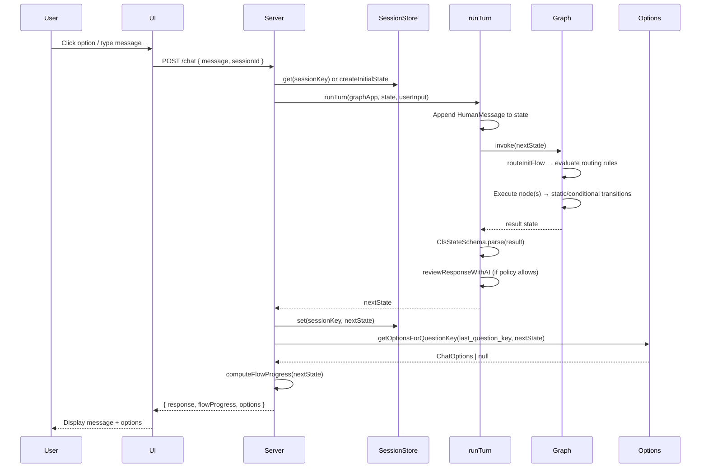
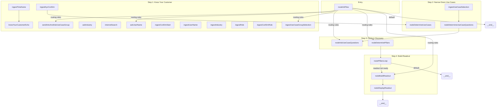
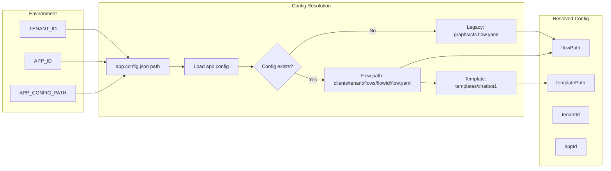
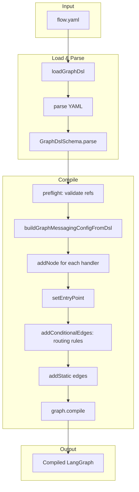
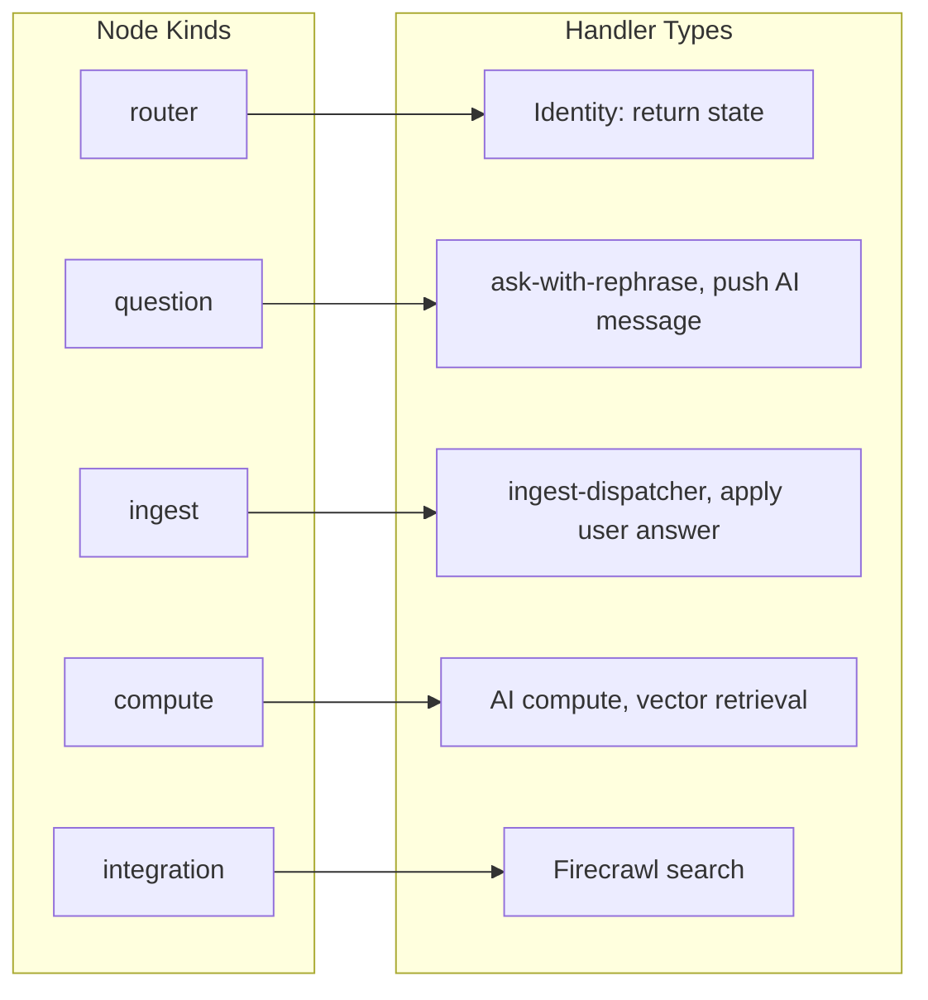

# CFS Chatbot — Architecture Diagram

## 1. System Overview

```mermaid
flowchart TB
    subgraph Client["Client Layer"]
        UI[HTML/JS/CSS Template]
        UI --> |POST /chat| API
    end

    subgraph Server["Express Server"]
        API[/chat endpoint]
        API --> SessionStore[(Session Store)]
        API --> runTurn[runTurn]
        API --> Options[getOptionsForQuestionKey]
        API --> Progress[computeFlowProgress]
    end

    subgraph Graph["LangGraph Layer"]
        runTurn --> GraphInvoke[graph.invoke]
        GraphInvoke --> StateGraph[StateGraph]
        StateGraph --> Router[routeInitFlow]
        StateGraph --> Nodes[Node Handlers]
    end

    subgraph Config["Config Layer"]
        AppConfig[app.config.json]
        FlowYAML[flow.yaml]
        AppConfig --> |flowId| FlowPath[Flow Path Resolution]
        FlowPath --> FlowYAML
    end

    subgraph Data["Data & Services"]
        Supabase[(Supabase / pgvector)]
        OpenAI[OpenAI API]
        Firecrawl[Firecrawl API]
    end

    Nodes --> Supabase
    Nodes --> OpenAI
    Nodes --> Firecrawl
    GraphInvoke --> FlowYAML
```

## 2. Chat Request Flow



## 3. LangGraph Flow Topology



## 4. Config Resolution & Multi-Tenancy



## 5. State & Option Resolution

```mermaid
flowchart TB
    subgraph State["CfsState Slices"]
        messages[messages]
        session_context[session_context]
        user_context[user_context]
        use_case_context[use_case_context]
        vector_context[vector_context]
        readout_context[readout_context]
    end

    subgraph Options["getOptionsForQuestionKey"]
        questionKey[questionKey: string | null]
        questionKey --> NullKey{questionKey null?}
        NullKey -->|Yes| Continuation[continuationTriggers]
        NullKey -->|No| Suggested[suggested_options from state]
        Suggested --> ConfigOpt[config.options]
        ConfigOpt --> DynamicOpt[dynamicOptions: service | state]
        Continuation --> MatchTrigger{matchesContinuationTrigger?}
        MatchTrigger -->|Yes| Items[items: string[]]
    end

    session_context --> questionKey
    session_context --> MatchTrigger
```

## 6. Graph Compilation Pipeline



## 7. Node Kinds & Handler Types


