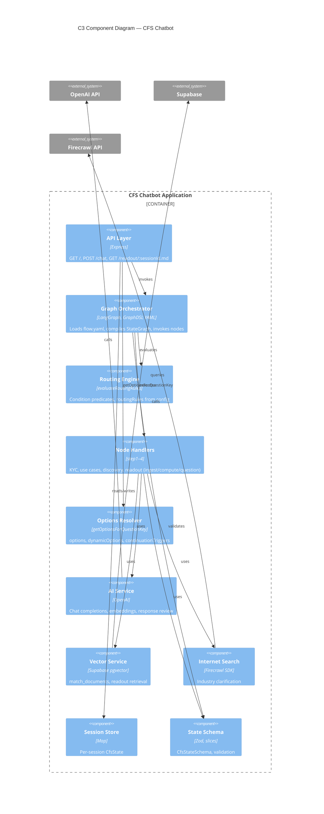

# CFS Chatbot — C3 Component Diagram

C4 Level 3 (Component) diagram showing internal components and their relationships.

```mermaid
C4Component
    title C3 Component Diagram — CFS Chatbot

    Container_Boundary(cfs, "CFS Chatbot Application", "Node.js, Express, LangGraph") {
        Component(api, "API Layer", "Express", "GET /, POST /chat, GET /readout/:sessionId.md")
        Component(graph, "Graph Orchestrator", "LangGraph, GraphDSL YAML", "Loads flow.yaml, compiles StateGraph, invokes nodes")
        Component(routing, "Routing Engine", "evaluateRoutingRules", "Condition predicates, routingRules from config")
        Component(handlers, "Node Handlers", "step1–4", "KYC, use cases, discovery, readout (ingest/compute/question)")
        Component(options, "Options Resolver", "getOptionsForQuestionKey", "options, dynamicOptions, continuationTriggers")
        Component(ai, "AI Service", "OpenAI", "Chat completions, embeddings, response review")
        Component(vector, "Vector Service", "Supabase pgvector", "match_documents, readout retrieval")
        Component(search, "Internet Search", "Firecrawl SDK", "Industry clarification")
        Component(session, "Session Store", "Map", "Per-session CfsState")
        Component(state, "State Schema", "Zod, slices", "CfsStateSchema, validation")
    }

    System_Ext(openai, "OpenAI API")
    System_Ext(supabase, "Supabase")
    System_Ext(firecrawl, "Firecrawl API")

    Rel(api, graph, "invokes")
    Rel(api, session, "reads/writes")
    Rel(api, options, "getOptionsForQuestionKey")
    Rel(graph, routing, "evaluates")
    Rel(graph, handlers, "executes")
    Rel(graph, state, "validates")
    Rel(handlers, ai, "uses")
    Rel(handlers, vector, "uses")
    Rel(handlers, search, "uses")
    Rel(handlers, state, "uses")
    Rel(ai, openai, "calls")
    Rel(vector, supabase, "queries")
    Rel(search, firecrawl, "calls")
```
