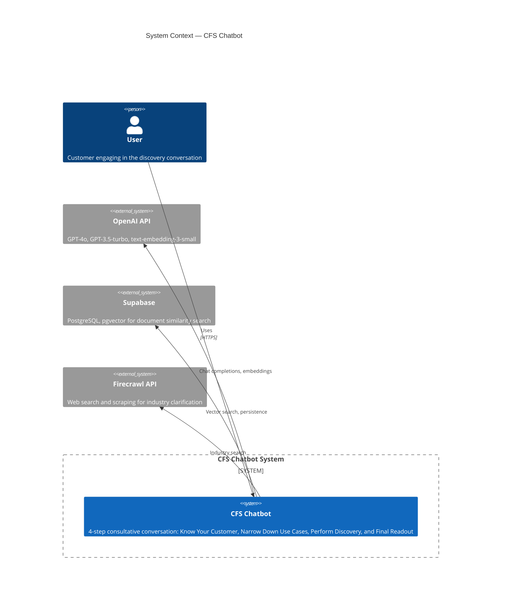
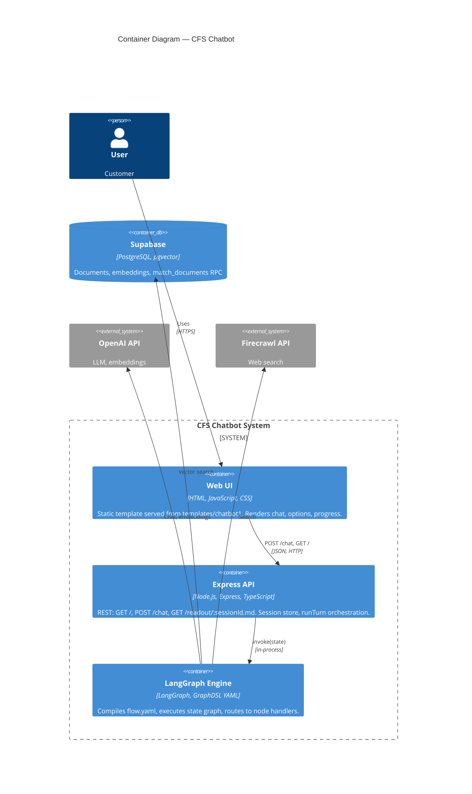
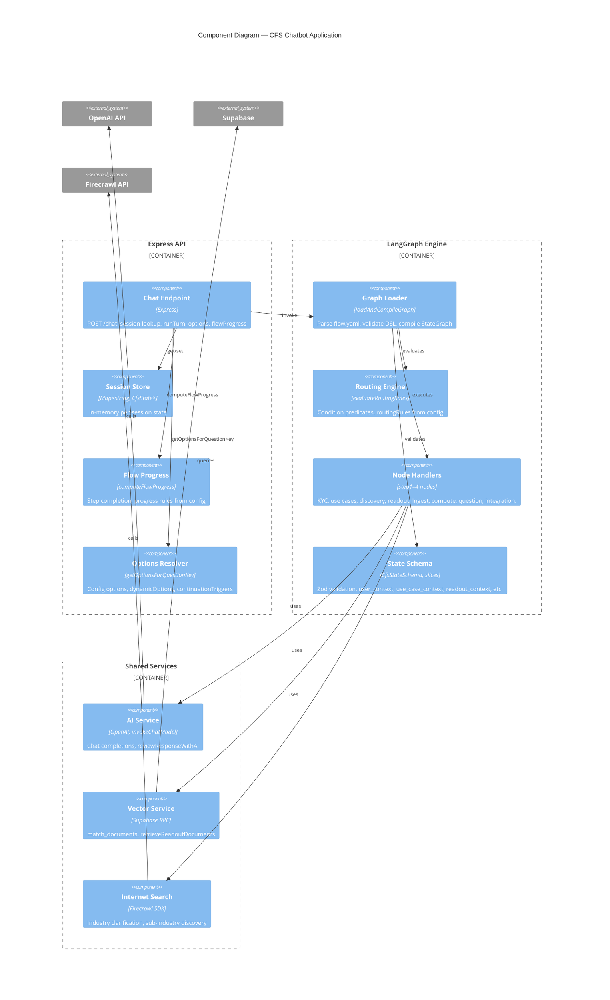
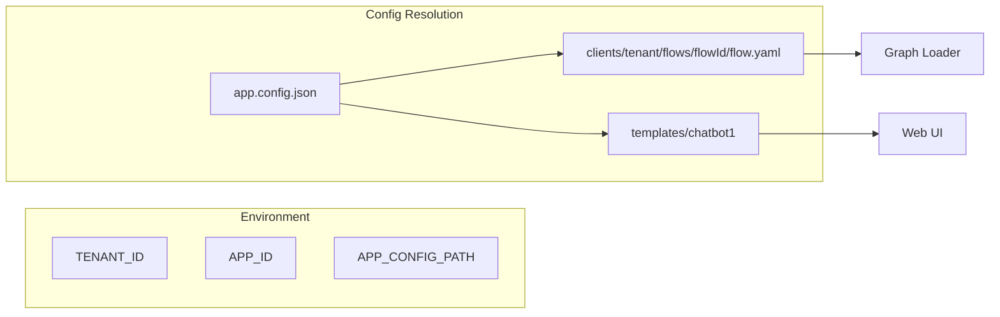

# CFS Chatbot — C4 Architecture (C3 Levels)

C4 model documentation for the CFS (Customer-Facing Sales) Chatbot. This document covers the first three levels: **Context**, **Container**, and **Component**.

---

## Level 1: System Context (C4Context)

Shows the CFS Chatbot system and its relationships with users and external systems.

---

## Level 2: Container (C4Container)

Shows the main deployable units within the CFS Chatbot system.

---

## Level 3: Component (C4Component)

Zooms into the Express API and LangGraph Engine to show internal components.

---

## Component Summary

| Component        | Technology              | Responsibility                                              |
|------------------|-------------------------|-------------------------------------------------------------|
| Chat Endpoint    | Express                 | POST /chat: session lookup, runTurn, options, flowProgress |
| Session Store    | Map                     | In-memory CfsState per sessionId                           |
| Flow Progress    | computeFlowProgress     | Step completion from progressRules, questionKeyMap         |
| Options Resolver | getOptionsForQuestionKey| options, dynamicOptions, continuationTriggers from config   |
| Graph Loader     | loadAndCompileGraph     | Parse flow.yaml, compile LangGraph StateGraph              |
| Routing Engine   | evaluateRoutingRules    | Condition predicates, routingRules from flow config        |
| Node Handlers    | step1–4 nodes           | KYC, use cases, discovery, readout (ingest/compute/question)|
| State Schema     | CfsStateSchema, slices | Zod validation, extensible state slices                    |
| AI Service       | OpenAI                  | Chat completions, embeddings, response review               |
| Vector Service   | Supabase pgvector       | match_documents, readout document retrieval                |
| Internet Search  | Firecrawl               | Industry clarification, sub-industry discovery                |

---

## Config & Multi-Tenancy

---

## Diagram Legend

- **Person**: Human user
- **System**: Software system
- **System_Ext**: External system (outside our control)
- **Container**: Deployable/runnable unit
- **ContainerDb**: Database
- **Component**: Internal building block
- **Rel**: Relationship/dependency
