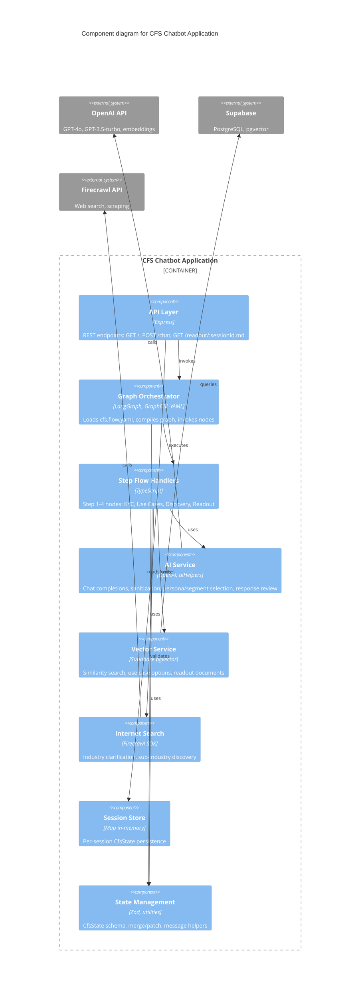

# CFS Chatbot — C4 Component Diagram (C3 Level)

This diagram follows the C4 model **Component level** (C3), zooming into the CFS Chatbot application to show its internal components and their relationships.

## Mermaid C4Component Diagram



## Alternative: PlantUML C4 Component (for Lucidchart / Structurizr)

If your tooling prefers PlantUML, use:

```plantuml
@startuml CFS Chatbot Component Diagram
!include https://raw.githubusercontent.com/plantuml-stdlib/C4-PlantUML/master/C4_Component.puml

title Component diagram for CFS Chatbot Application

Container_Boundary(cfs, "CFS Chatbot Application") {
    Component(api, "API Layer", "Express", "REST: GET /, POST /chat, GET /readout/:sessionId.md")
    Component(graph, "Graph Orchestrator", "LangGraph, GraphDSL YAML", "Loads cfs.flow.yaml, compiles, invokes")
    Component(handlers, "Step Flow Handlers", "TypeScript", "Step 1-4 nodes: KYC, Use Cases, Discovery, Readout")
    Component(ai, "AI Service", "OpenAI, aiHelpers", "Chat completions, sanitization, selection, review")
    Component(vector, "Vector Service", "Supabase pgvector", "Similarity search, use case options")
    Component(search, "Internet Search", "Firecrawl SDK", "Industry clarification, sub-industry discovery")
    Component(session, "Session Store", "Map in-memory", "Per-session CfsState")
    Component(state, "State Management", "Zod, utilities", "CfsState schema, merge, message helpers")
}

System_Ext(openai, "OpenAI API", "GPT-4o, GPT-3.5-turbo, embeddings")
System_Ext(supabase, "Supabase", "PostgreSQL, pgvector")
System_Ext(firecrawl, "Firecrawl API", "Web search, scraping")

Rel(api, graph, "invokes")
Rel(api, session, "reads/writes")
Rel(graph, handlers, "executes")
Rel(handlers, ai, "uses")
Rel(handlers, vector, "uses")
Rel(handlers, search, "uses")
Rel(handlers, state, "uses")
Rel(graph, state, "validates")
Rel(ai, openai, "calls")
Rel(vector, supabase, "queries")
Rel(search, firecrawl, "calls")

SHOW_LEGEND()
@enduml
```

## Component Summary

| Component          | Technology        | Responsibility                                      |
|-------------------|-------------------|------------------------------------------------------|
| API Layer         | Express           | HTTP routes, request/response, session lookup        |
| Graph Orchestrator| LangGraph, YAML   | Graph compilation, node invocation, routing          |
| Step Flow Handlers| TypeScript        | Step 1–4 conversation nodes (KYC, use cases, etc.)   |
| AI Service        | OpenAI, aiHelpers | LLM calls, input sanitization, persona/segment AI   |
| Vector Service    | Supabase pgvector | Vector search, use case options, readout docs        |
| Internet Search   | Firecrawl         | Industry clarification, sub-industry discovery      |
| Session Store     | Map               | In-memory session state                             |
| State Management  | Zod, utilities    | CfsState schema, validation, merge/patch helpers    |
